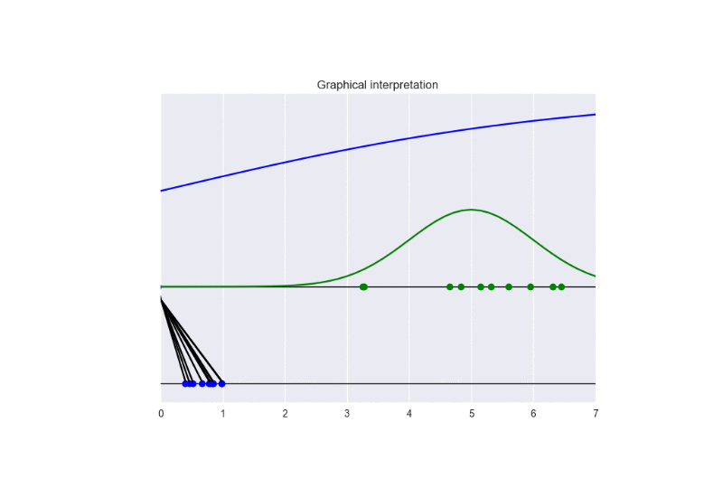
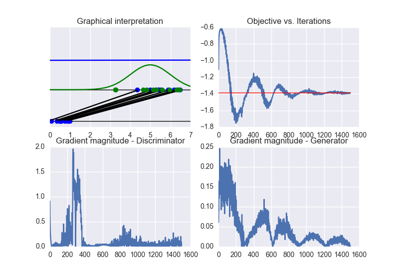
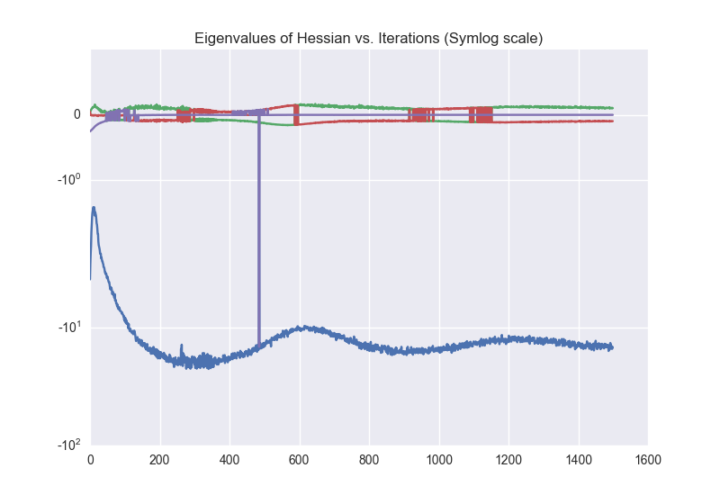
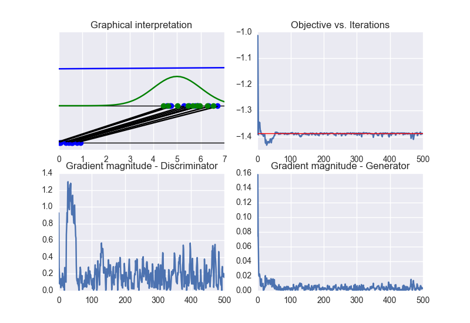
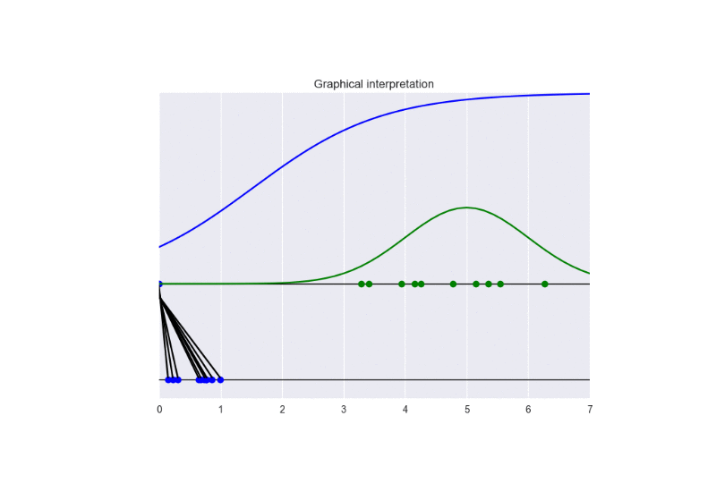
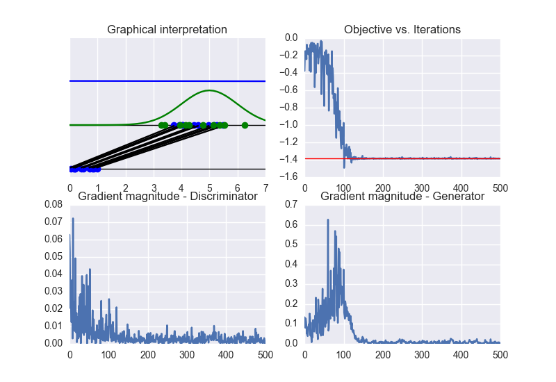

# Tutorial on Generative Adversarial Networks (GANs)
This tutorial introduces GANs with some intuitive examples. Furthermore, it describes some problems arising when training these models.

The tutorial is based on the original formulation of GANs (see [reference](https://arxiv.org/pdf/1406.2661.pdf)) and on a theoretical work published at ICLR 2017 (see [reference](https://arxiv.org/pdf/1701.04862.pdf))

## Prerequisites
Install the following Python modules:
* Tensorflow 1.0.0
* Scipy 0.17.0
* Numpy 1.12.0
* Seaborn 0.7.1
* Matplotlib 1.5.1

## Theory
Check [reference](https://emsansone.github.io/teaching/GANs.pdf) for theoretical insights about GANs

## Traditional GANs
### **GANs (normal setting)**
In _gan.py_ set:

    GAMES = 1500
    DISCR_UPDATE = 1
    GEN_UPDATE = 1

This runs the training for 1000 games. In this case, the gradients of both the discriminator and the generator are updated according to a balanced strategy.
See the following animation for an intuitive understanding of the training procedure: 

The generator takes in input some noise samples (drawn from a uniform distribution, see the blue points in the lower part of the animation) and transforms them in new samples (see the blue points in the upper part of the the animation), which tend to be similar to the training data (drawn from a Gaussian distribution, see the green points and the green line in the animation).
The discriminator (the blue line) predicts if data are fake (low score) or real (high score).

In this case, the training converges to the optimal solution (this happens when the objective function converges to `-2log(2)` and the discriminator approaches a constant function whose value is equal to `1/2`. In other words, the discriminator becomes completely confused, since it is not able to distinguish generated data from training data). See the following figure for a summary of these properties: 

By checking the eigenvalues of the Hessian matrix (over iterations), we can conclude that the Hessian is non-definite. Therefore, the obtained solution lies on a **sadlle point** of the objective function. See the following figure: 

### **GANs (strong discriminator)**
In _gan.py_ set:

    GAMES = 500
    DISCR_UPDATE = 50
    GEN_UPDATE = 1

In this setting, we update the discriminator more frequently than the generator. This examples shows the problem of **vanishing gradients**. See the following animation: 

It is clear that the generator cannot be learn properly due to the excessive strength of the discriminator. In this case, the training converges to a solution different from the optimal one. See the following figure: 

By checking the eigenvalues of the Hessian matrix (over iterations), we can observe that the obtained solution corresponds to a **local maximum** of the objective function (due to the negative definiteness of the Hessian), namely: 

### **GANs (strong generator)**
In _gan.py_ set:

    GAMES = 500
    DISCR_UPDATE = 1
    GEN_UPDATE = 50

In this setting, we observe a faster convergence to the optimal solution. Nevertheless, a bad initialization could lead to **instability** problems. See the following animation: 

See the summary of training: 

## Noisy GANs
Noisy GANs (see [reference](https://arxiv.org/pdf/1701.04862.pdf)) have been proposed to solve the problem of vanishing gradients. Let us consider the case of strong discriminator, namely:

    GAMES = 500
    DISCR_UPDATE = 50
    GEN_UPDATE = 1

The following animation gives some insights about the training procedure.

The following picture summarizes the results.

Now, we can clearly see that the obtained solution converges to the optimal one (differently from the previous case of traditional GANs).